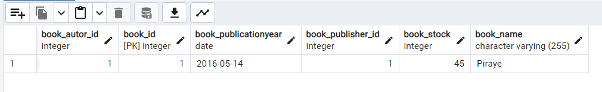
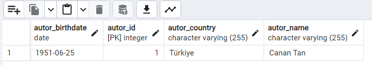
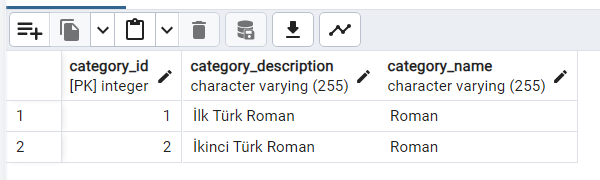
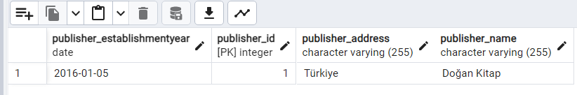
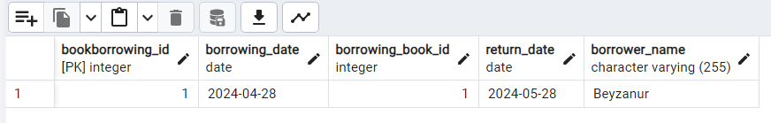
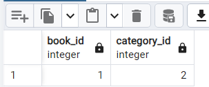

## Kütüphane Yönetim Sistemi

- JPA kullanarak kütüphane yönetim sistemi tasarlanmıştır.

- Yazar, yayıncı, kitap ve kategori gibi temel varlıkları temsil etmek ve ilişkilendirmek.
- Kitap ödünç alma işlemlerini yönetmek.
- Veritabanıyla etkileşimde bulunmak için JPA (Java Persistence API) kullanımını göstermek.

## Kullanılan Teknolojiler ve Kütüphaneler

- Java SE
- Jakarta Persistence API (JPA)
- Hibernate (JPA implementasyonu için)
- PostgreSQL (veritabanı)

## Proje İçeriği

- Author: Yazar bilgilerini temsil eder.
- Publisher: Yayıncı bilgilerini temsil eder.
- Book: Kitap bilgilerini ve ilişkilerini yönetir (yazar, yayıncı, kategori).
- Category: Kitap kategorilerini temsil eder.
- BookBorrowing: Kitap ödünç alma işlemlerini yönetir.

## Veritabanı Yapısı

- author: Yazar bilgilerini saklar.
- publisher: Yayıncı bilgilerini saklar.
- book: Kitap bilgilerini saklar.
- category: Kitap kategorilerini saklar.
- book_borrowing: Kitap ödünç alma işlemlerini saklar.

- Book Table
  
- Author Table
  
- Category Table
  
- Publisher Table
  
- BookBorrowing Table
  
- CategoryBook Table
  
